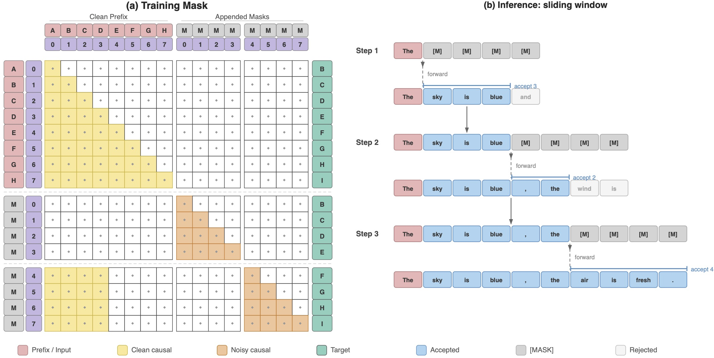
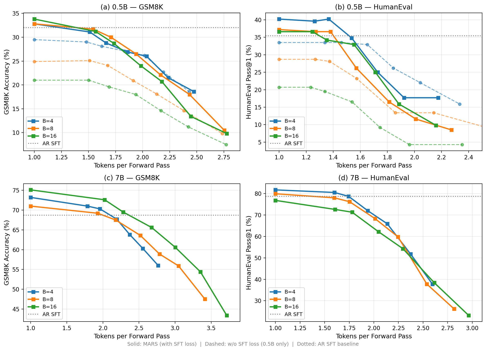

<div align="center">

# MARS: Enabling Autoregressive Models Multi-Token Generation

</div>

<p align="center">
  
</p>

**MARS** converts any instruction-tuned autoregressive (AR) model into a
multi-token predictor with **zero architectural changes, zero additional
parameters, and a single checkpoint**. The AR capability is fully preserved;
multi-token generation is available as an opt-in acceleration mode. A fine-tuned
model checkpoint can be served at a quality-latency tradeoff chosen
per-request.

## TL;DR

- **Lossless at τ=1.0.** MARS matches or exceeds AR SFT on IFEval, BBH,
  MMLU-Pro, GPQA, GSM8K, and HumanEval when decoding one token at a time.
- **1.5–1.7× tokens-per-forward** at τ=0.95 with minimal accuracy loss.
- **Up to 1.69× wall-clock** over AR-with-KV-cache on Qwen2.5-7B via
  block-level KV caching.
- **One knob at inference time.** The confidence threshold τ trades quality
  for speed per request. No separate draft model, no new heads.
- **Zero architectural changes.** MARS is a fine-tuning method, not a new
  architecture. Inherits all AR serving infrastructure.

## Updates

- **2026-04-20** — Uploaded 7B blk8/16 models to HuggingFace.

## How it works

MARS is trained with a `[noisy | clean]` concatenation and a structured
attention mask that keeps the clean stream pure-causal (AR) while letting the
noisy stream predict a full block of masked tokens in parallel, conditioned
only on the clean tokens from *previous* blocks. At inference the sampler
walks left-to-right, appending `B` mask tokens at the cursor, running one
forward, and accepting the prefix of greedy predictions whose confidence
passes threshold τ. When the model is confident, it commits multiple tokens
per forward; when it is uncertain, it falls back to one-token AR.

### The loss

```
L = CE(noisy_logits, labels)        # multi-token prediction
  + α · CE(clean_logits, labels)    # AR loss on the clean stream
```

The auxiliary AR term (`ar_weight=1.0`) prevents the AR-like training signal
from decaying as `1/B` as block size grows, and is the key ingredient behind
MARS's stability at `B=8` and `B=16`.

## Results

<p align="center">
  
</p>

Solid lines: MARS (with SFT loss). Dashed: without SFT loss (0.5B only).
Dotted: AR SFT baseline. Each point corresponds to a different confidence
threshold τ ∈ {1.0, 0.95, 0.9, 0.8, 0.7, 0.6, 0.5}.

At τ=1.0 (leftmost point on each curve), MARS sits at or above the AR SFT
line — a strong precondition: no quality is sacrificed for the option to
accelerate. From there, lowering τ trades accuracy for tokens/forward along
a smooth Pareto curve.

## Setup

```bash
git clone https://github.com/Xalp/MARS.git
cd MARS
bash setup_env.sh
conda activate mars
```

## Pretrained Models

All models available on HuggingFace.

### 7B (Qwen2.5-7B-Instruct)

| Model | Block Size | HuggingFace |
|-------|:----------:|-------------|
| AR SFT                   | —  | [Xalphinions/MARS-Qwen2.5-7B-AR-SFT](https://huggingface.co/Xalphinions/MARS-Qwen2.5-7B-AR-SFT) |
| MARS                     | 4  | [Xalphinions/MARS-Qwen2.5-7B-blk4](https://huggingface.co/Xalphinions/MARS-Qwen2.5-7B-blk4) |
| MARS                     | 8  | [Xalphinions/MARS-Qwen2.5-7B-blk8](https://huggingface.co/Xalphinions/MARS-Qwen2.5-7B-blk8) |
| MARS                     | 16 | [Xalphinions/MARS-Qwen2.5-7B-blk16](https://huggingface.co/Xalphinions/MARS-Qwen2.5-7B-blk16) |

### 0.5B (Qwen2.5-0.5B-Instruct)

| Model | Block Size | HuggingFace |
|-------|:----------:|-------------|
| AR SFT                   | —  | [Xalphinions/MARS-Qwen2.5-0.5B-AR-SFT](https://huggingface.co/Xalphinions/MARS-Qwen2.5-0.5B-AR-SFT) |
| MARS                     | 4  | [Xalphinions/MARS-Qwen2.5-0.5B-blk4](https://huggingface.co/Xalphinions/MARS-Qwen2.5-0.5B-blk4) |
| MARS                     | 8  | [Xalphinions/MARS-Qwen2.5-0.5B-blk8](https://huggingface.co/Xalphinions/MARS-Qwen2.5-0.5B-blk8) |
| MARS                     | 16 | [Xalphinions/MARS-Qwen2.5-0.5B-blk16](https://huggingface.co/Xalphinions/MARS-Qwen2.5-0.5B-blk16) |
| MARS (no SFT loss)       | 4  | [Xalphinions/MARS-Qwen2.5-0.5B-blk4-no-sft](https://huggingface.co/Xalphinions/MARS-Qwen2.5-0.5B-blk4-no-sft) |
| MARS (no SFT loss)       | 8  | [Xalphinions/MARS-Qwen2.5-0.5B-blk8-no-sft](https://huggingface.co/Xalphinions/MARS-Qwen2.5-0.5B-blk8-no-sft) |
| MARS (no SFT loss)       | 16 | [Xalphinions/MARS-Qwen2.5-0.5B-blk16-no-sft](https://huggingface.co/Xalphinions/MARS-Qwen2.5-0.5B-blk16-no-sft) |
| BD3LM (baseline)         | 4  | [Xalphinions/MARS-Qwen2.5-0.5B-BD3LM-blk4](https://huggingface.co/Xalphinions/MARS-Qwen2.5-0.5B-BD3LM-blk4) |

## Repository Structure

```
MARS/
├── mars/                          # Core MARS code
│   ├── trainers/
│   │   ├── attention_mask.py      # MARS training attention mask
│   │   └── mars_trainer.py        # MARSTrainer (with / without SFT loss)
│   ├── samplers/
│   │   ├── mars_sampler.py        # Sliding-window sampler
│   │   ├── mars_cached_sampler.py # KV-cached sampler (per-step + block-level)
│   │   └── mars_batch_sampler.py  # Batch sampler
│   └── eval_harness.py            # lm-eval integration
├── dllm/                          # Base infrastructure (trainers, configs, data utils)
├── train/                         # Training entry points
│   ├── train_ar_sft.py            # Stage 1: Standard AR SFT
│   ├── train_mars.py              # Stage 2: MARS (with SFT loss)
│   └── train_mars_no_sft.py       # Stage 2: MARS (without SFT loss)
└── scripts/                       # Experiment scripts (train / eval / benchmark)
```

## Training

MARS uses a two-stage pipeline:

- **Stage 1: AR SFT** — standard next-token prediction fine-tuning. This is
  a control step to isolate MARS's effect from the effect of additional data
  exposure.
- **Stage 2: MARS** — masked block prediction with auxiliary AR loss, starting
  from the Stage 1 checkpoint.

### Quick Start (0.5B)

```bash
export BASE_DIR=/path/to/experiment/root
bash scripts/train/train_0.5b.sh
```

### Manual commands

```bash
# Stage 1: AR SFT
accelerate launch --config_file scripts/accelerate_configs/zero2.yaml \
    --num_processes 8 train/train_ar_sft.py \
    --model_name_or_path Qwen/Qwen2.5-0.5B-Instruct \
    --output_dir ${BASE_DIR}/models/ar_sft \
    --dataset_args allenai/Dolci-Instruct-SFT \
    --num_train_epochs 5 --learning_rate 5e-6 \
    --per_device_train_batch_size 48 --max_length 512 --bf16

# Stage 2: MARS (with SFT loss, block_size=4)
accelerate launch --config_file scripts/accelerate_configs/zero2.yaml \
    --num_processes 8 train/train_mars.py \
    --model_name_or_path ${BASE_DIR}/models/ar_sft/checkpoint-final \
    --output_dir ${BASE_DIR}/models/mars_blk4 \
    --dataset_args allenai/Dolci-Instruct-SFT \
    --num_train_epochs 5 --learning_rate 5e-6 \
    --per_device_train_batch_size 48 --max_length 512 \
    --block_size 4 --right_shift_logits --ar_weight 1.0 --bf16
```

## Evaluation

### One-token mode (τ=1.0, Table 2)

No acceleration, isolates quality.

```bash
accelerate launch --num_processes 8 mars/eval_harness.py \
    --tasks gsm8k_cot --num_fewshot 0 \
    --model mars --apply_chat_template \
    --model_args "pretrained=${BASE_DIR}/models/mars_blk4/checkpoint-final,max_new_tokens=256,steps=256,block_size=4,cfg=0.0,right_shift_logits=True"
```

### Multi-token mode (τ=0.95, Table 4)

Commits the prefix of greedy predictions whose probabilities exceed τ.

```bash
accelerate launch --num_processes 8 mars/eval_harness.py \
    --tasks gsm8k_cot --num_fewshot 0 \
    --model mars --apply_chat_template \
    --model_args "pretrained=${BASE_DIR}/models/mars_blk4/checkpoint-final,max_new_tokens=256,steps=256,block_size=4,cfg=0.0,right_shift_logits=True,confidence_threshold=0.95"
```

### Block-cached batch inference (Table 5, wall-clock)

```bash
python scripts/benchmark/bench_block_cached.py \
    --mars_model ${BASE_DIR}/models/mars_blk4/checkpoint-final \
    --ar_model ${BASE_DIR}/models/ar_sft/checkpoint-final \
    --batch_size 16 --block_sizes "4,8,16,32" --threshold 0.95
```

## Reproducing Paper Results

| Script | Paper Reference |
|--------|-----------------|
| `scripts/train/train_0.5b.sh`            | Table 2 (0.5B models)                  |
| `scripts/train/train_7b.sh`              | Table 2 (7B models)                    |
| `scripts/train/train_blk8_16.sh`         | Table 3 (block size ablation)          |
| `scripts/train/train_bd3lm_baseline.sh`  | Table 2 (BD3LM baseline)               |
| `scripts/eval/eval_main.sh`              | Table 2 (main results)                 |
| `scripts/eval/eval_threshold_095.sh`     | Table 4 (multi-token at τ=0.95)        |
| `scripts/eval/eval_threshold_sweep.sh`   | Appendix Table 15 (full sweep)         |
| `scripts/eval/eval_acceptance_metrics.sh`| Appendix Figure 7 (metric comparison)  |
| `scripts/benchmark/bench_block_cached.sh`| Table 5 (wall-clock speedup)           |
| `scripts/benchmark/bench_full_sweep.sh`  | Figure 5 (parameter sweep)             |

## Hyperparameters

|                       | 0.5B                    | 7B                      |
|-----------------------|-------------------------|-------------------------|
| Base model            | Qwen2.5-0.5B-Instruct   | Qwen2.5-7B-Instruct     |
| Dataset               | Dolci-Instruct-SFT (~2M)| Dolci-Instruct-SFT (~2M)|
| Epochs (both stages)  | 5                       | 5                       |
| Learning rate         | 5e-6                    | 5e-6                    |
| Effective batch size  | 384                     | 384                     |
| Max sequence length   | 512                     | 512                     |
| Warmup ratio          | 0.03                    | 0.03                    |
| Block sizes tested    | 4, 8, 16                | 4, 8, 16                |
| Hardware              | 8× H200                 | 8× H200                 |

## Citation

```bibtex
@misc{jin2026marsenablingautoregressivemodels,
      title={MARS: Enabling Autoregressive Models Multi-Token Generation}, 
      author={Ziqi Jin and Lei Wang and Ziwei Luo and Aixin Sun},
      year={2026},
      eprint={2604.07023},
      archivePrefix={arXiv},
      primaryClass={cs.CL},
      url={https://arxiv.org/abs/2604.07023}, 
}
```
